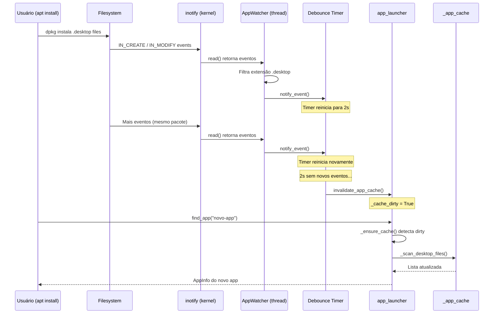

# Design Técnico — App Watcher

## Overview

O App Watcher é um componente reativo que monitora diretórios de arquivos `.desktop` via inotify do Linux, detecta instalações/remoções de aplicativos em tempo real e invalida o cache do `app_launcher` automaticamente. Ele se integra ao ciclo de vida do MCP seguindo o mesmo padrão dos watchers existentes (wifi via `nmcli monitor`, áudio via `pactl subscribe`).

A implementação usa inotify diretamente via `ctypes` (sem dependências externas), executa em uma thread daemon dedicada e aplica debounce de 2 segundos para agrupar múltiplos eventos de uma instalação de pacote em um único rescan.

## Architecture

O AppWatcher se encaixa na camada de watchers reativos do MCP, paralelo aos watchers de rede e áudio:

```mermaid
graph TD
    MCP["SystemContext (mcp.py)"]
    
    subgraph Watchers Reativos
        NW["_watch_network()"]
        AW["_watch_audio()"]
        APW["AppWatcher"]
    end
    
    subgraph Subsistemas
        AL["app_launcher.py"]
        CACHE["_app_cache (list[AppInfo])"]
    end
    
    MCP -->|start()| NW
    MCP -->|start()| AW
    MCP -->|"start() (após warmup)"| APW
    
    APW -->|"inotify events"| DEBOUNCE["Debounce Timer (2s)"]
    DEBOUNCE -->|"expira"| AL
    AL -->|"invalidate + rebuild"| CACHE
    
    MCP -->|stop()| APW
```

### Fluxo de Dados



## Components and Interfaces

### 1. Classe `AppWatcher`

**Localização:** `cios/core/app_watcher.py`

```python
class AppWatcher:
    """Monitora diretórios de .desktop files via inotify e invalida o cache do app_launcher."""

    WATCHED_DIRS: list[Path] = [
        Path("/usr/share/applications"),
        Path.home() / ".local" / "share" / "applications",
    ]
    DEBOUNCE_SECONDS: float = 2.0

    def __init__(self) -> None:
        self._inotify_fd: int = -1
        self._watch_descriptors: dict[int, Path] = {}  # wd → dir path
        self._running: bool = False
        self._thread: threading.Thread | None = None
        self._debounce_timer: threading.Timer | None = None
        self._debounce_lock: threading.Lock = threading.Lock()

    def start(self) -> None:
        """Inicializa inotify e inicia a thread de monitoramento.
        
        Raises:
            OSError: Se inotify_init() falhar (capturado pelo MCP).
        """
        ...

    def stop(self) -> None:
        """Encerra monitoramento, cancela timers e fecha o fd do inotify."""
        ...

    def _monitor_loop(self) -> None:
        """Loop principal: select() no fd do inotify, lê eventos, filtra e faz debounce."""
        ...

    def _on_event(self, filename: str) -> None:
        """Chamado para cada evento. Filtra por .desktop e aciona debounce."""
        ...

    def _reset_debounce(self) -> None:
        """Cancela timer existente e cria novo timer de 2s."""
        ...

    def _on_debounce_expire(self) -> None:
        """Callback do timer — chama invalidate_app_cache()."""
        ...
```

### 2. Modificações no `app_launcher.py`

A invalidação atual (`invalidate_app_cache()`) já existe mas não é thread-safe. Adicionamos:

```python
import threading

_cache_lock = threading.Lock()
_cache_dirty = False  # Flag atômica para lazy rebuild

def invalidate_app_cache() -> None:
    """Marca o cache como sujo (thread-safe). Rebuild ocorre na próxima consulta."""
    global _cache_dirty
    with _cache_lock:
        _cache_dirty = True

def _ensure_cache() -> list[AppInfo]:
    """Carrega ou reconstrói o cache se necessário (thread-safe)."""
    global _app_cache, _cache_loaded, _cache_dirty
    with _cache_lock:
        if not _cache_loaded or _cache_dirty:
            _app_cache = _scan_desktop_files()
            _cache_loaded = True
            _cache_dirty = False
    return _app_cache
```

**Decisão de design:** Usamos `_cache_dirty` flag + lazy rebuild em vez de rebuild imediato na thread do watcher. Isso evita que o rescan (operação de I/O) execute na thread do debounce timer, mantendo-o na thread que realmente precisa dos dados.

**Decisão de design:** O lock protege a seção crítica inteira de `_ensure_cache()` — leitura da flag + rebuild + atualização da referência. Isso garante que apenas uma thread reconstrói o cache, e leituras concorrentes obtêm o cache antigo (completo) ou o novo (completo), nunca um estado parcial.

### 3. Integração com `mcp.py`

```python
# Em SystemContext.start(), após _warmup_parallel():
from cios.core.app_watcher import AppWatcher

class SystemContext:
    def __init__(self) -> None:
        ...
        self._app_watcher: AppWatcher | None = None

    def start(self, ...):
        ...
        self._warmup_parallel()
        ...
        # App watcher (após warmup)
        try:
            self._app_watcher = AppWatcher()
            self._app_watcher.start()
        except Exception as e:
            logger.warning("App watcher failed to start: %s", e)
            self._app_watcher = None

    def stop(self) -> None:
        ...
        if self._app_watcher:
            self._app_watcher.stop()
```

### 4. Interface inotify via ctypes

```python
import ctypes
import ctypes.util
import struct
import select

_libc = ctypes.CDLL(ctypes.util.find_library("c"), use_errno=True)

# Constantes inotify
IN_CREATE = 0x00000100
IN_MODIFY = 0x00000002
IN_DELETE = 0x00000200
IN_MOVED_TO = 0x00000080
IN_MOVED_FROM = 0x00000040
WATCH_MASK = IN_CREATE | IN_MODIFY | IN_DELETE | IN_MOVED_TO | IN_MOVED_FROM

def _inotify_init() -> int:
    """Cria um file descriptor inotify. Retorna fd ou raise OSError."""
    fd = _libc.inotify_init()
    if fd < 0:
        errno = ctypes.get_errno()
        raise OSError(errno, os.strerror(errno))
    return fd

def _inotify_add_watch(fd: int, path: str, mask: int) -> int:
    """Adiciona watch em um diretório. Retorna watch descriptor."""
    wd = _libc.inotify_add_watch(fd, path.encode(), mask)
    if wd < 0:
        errno = ctypes.get_errno()
        raise OSError(errno, os.strerror(errno))
    return wd
```

## Data Models

### Estrutura do evento inotify (struct inotify_event)

```
struct inotify_event {
    int      wd;       /* Watch descriptor */
    uint32_t mask;     /* Mask of events */
    uint32_t cookie;   /* Unique cookie (for rename) */
    uint32_t len;      /* Length of name field */
    char     name[];   /* Optional filename */
};
```

Tamanho mínimo do header: 16 bytes. O campo `name` é variável e null-padded.

### Parse do evento em Python:

```python
EVENT_HEADER_SIZE = 16  # struct.calcsize("iIII")

def _parse_events(buffer: bytes) -> list[tuple[int, int, str]]:
    """Retorna lista de (wd, mask, filename) do buffer de eventos."""
    events = []
    offset = 0
    while offset < len(buffer):
        wd, mask, cookie, length = struct.unpack_from("iIII", buffer, offset)
        offset += EVENT_HEADER_SIZE
        if length > 0:
            name = buffer[offset:offset + length].rstrip(b"\x00").decode("utf-8", errors="replace")
            events.append((wd, mask, name))
        offset += length
    return events
```

## Correctness Properties

*Uma propriedade é uma característica ou comportamento que deve valer para todas as execuções válidas de um sistema — essencialmente, uma declaração formal sobre o que o sistema deve fazer. Propriedades servem como ponte entre especificações legíveis por humanos e garantias de corretude verificáveis por máquinas.*

### Property 1: Filtro de extensão .desktop

*Para qualquer* nome de arquivo gerado aleatoriamente, o filtro de eventos do AppWatcher deve aceitar o arquivo se e somente se ele terminar com a extensão `.desktop`.

**Validates: Requirements 1.5**

### Property 2: Resiliência a diretórios inexistentes

*Para qualquer* subconjunto dos diretórios monitorados onde alguns não existem no filesystem, o AppWatcher deve inicializar sem lançar exceção e deve monitorar exatamente os diretórios que existem.

**Validates: Requirements 1.4**

### Property 3: Debounce correto — único rescan após período de silêncio

*Para qualquer* sequência de N eventos (N ≥ 1) onde todos ocorrem com intervalo menor que 2 segundos entre si, seguida de silêncio de pelo menos 2 segundos, o número de rescans disparados deve ser exatamente 1, e o rescan deve ocorrer entre 2s e 2s + ε após o último evento.

**Validates: Requirements 2.1, 2.2, 2.3, 2.4**

### Property 4: Round-trip de invalidação do cache

*Para qualquer* estado válido do cache e qualquer conjunto de arquivos `.desktop` no disco, após chamar `invalidate_app_cache()`, a próxima chamada a `find_app()` ou `get_installed_apps()` deve retornar resultados consistentes com o estado atual dos arquivos em disco.

**Validates: Requirements 3.2**

### Property 5: Thread safety nas leituras concorrentes durante reconstrução

*Para qualquer* combinação de threads fazendo leituras (`find_app()`, `get_installed_apps()`) e invalidações (`invalidate_app_cache()`) concorrentemente, nenhuma leitura deve retornar `None` inesperado, lançar exceção ou retornar dados parcialmente construídos.

**Validates: Requirements 3.3, 5.1, 5.2**

### Property 6: Idempotência de invalidação concorrente

*Para qualquer* número N de chamadas concorrentes a `invalidate_app_cache()`, o número de rescans efetivos (execuções de `_scan_desktop_files()`) na próxima consulta deve ser no máximo 1.

**Validates: Requirements 5.3**

## Error Handling

| Cenário | Comportamento |
|---------|--------------|
| `inotify_init()` falha (errno) | AppWatcher.start() lança OSError; MCP captura, loga warning e continua sem watcher |
| `inotify_add_watch()` falha para um diretório | Diretório é ignorado; os demais continuam monitorados |
| Diretório monitorado não existe | Ignorado silenciosamente no start() |
| Erro de leitura no fd do inotify | Loop faz log.debug e continua (inotify_fd permanece válido) |
| Thread do watcher morre inesperadamente | Daemon thread — processo principal não é afetado; cache para de ser atualizado automaticamente mas continua funcional |
| `_scan_desktop_files()` lança exceção durante rebuild | Lock é liberado via context manager; `_cache_dirty` permanece True para retry na próxima consulta |

## Testing Strategy

### Testes Unitários (pytest)

- **Filtro de extensão**: Verificar que `_on_event("app.desktop")` aciona debounce e `_on_event("readme.txt")` não
- **Diretório inexistente**: Mockar `Path.is_dir()` para retornar False em um dir e verificar que start() não falha
- **Falha do inotify**: Mockar `_inotify_init()` para retornar -1 e verificar que OSError é lançada
- **Integração MCP**: Verificar que `context.start()` funciona mesmo se AppWatcher falhar
- **Invalidação + rebuild**: Chamar `invalidate_app_cache()` e verificar que próxima consulta escaneia

### Testes de Propriedade (hypothesis)

A biblioteca de property-based testing será **hypothesis** (já disponível no projeto como dependência de teste).

Cada teste de propriedade deve:
- Executar mínimo **100 iterações** (configuração padrão do hypothesis)
- Referenciar a propriedade de design no docstring
- Usar o formato de tag: **Feature: app-watcher, Property {N}: {texto}**

Propriedades implementáveis como PBT:

1. **Filtro .desktop** — Gerar nomes de arquivo aleatórios via `st.text()`, verificar que o filtro aceita sse termina em `.desktop`
2. **Resiliência a diretórios** — Gerar subconjuntos aleatórios de `WATCHED_DIRS` com existência booleana, verificar start() sem exceção
3. **Debounce** — Gerar sequências de timestamps (via `st.lists(st.floats(min_value=0, max_value=1.9))`) e verificar que exatamente 1 callback é disparado após silêncio
4. **Round-trip invalidação** — Gerar conjuntos de AppInfo aleatórios, popular o cache, invalidar, e verificar que próxima leitura escaneia do disco
5. **Thread safety** — Gerar sequências de operações (leitura/invalidação) e executar concorrentemente, verificar ausência de exceções
6. **Idempotência** — Gerar N invalidações (1-50), executar concorrentemente, contar scans efetivos ≤ 1

### Testes de Integração

- Criar arquivos `.desktop` temporários em um tmpdir, apontar o watcher para ele e verificar end-to-end que o cache é atualizado
- Verificar ciclo completo: start → evento → debounce → invalidação → consulta retorna app novo
